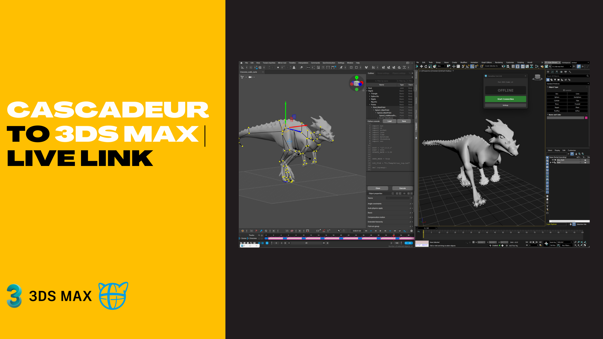

# 🚀 Cascadeur to 3ds Max Live Link
for Autodesk 3ds Max 2025+

A high-performance, real-time synchronization bridge between **Cascadeur** and **Autodesk 3ds Max**. This tool streamlines the animation workflow by streaming character transforms and syncing meshes instantly, eliminating the need for constant FBX export/import cycles.

## ✨ Key Features
* **One-Click Mesh Sync**: Automatically exports FBX from Cascadeur and imports it into 3ds Max with proper metadata tagging.
* **Real-time Animation Streaming**: Streams joint positions and rotations directly to the 3ds Max scene at a high update rate.
* **Smart Cleanup**: Automatically detects and replaces previous synced bridge objects to keep your scene organized.
* **Dynamic Scaling**: Includes a global scale factor to ensure unit consistency between different project requirements.
* **Non-Blocking UI**: Built with PySide6 and multi-threading to ensure 3ds Max remains responsive during data transfer.

## 🛠 Prerequisites
* **3ds Max**: 2025 or higher (supports `pymxs` and `PySide6`).
* **Cascadeur**: Any version supporting Python scripting.
* **Network**: Both applications must have access to Localhost (Port 5555 by default).

## 🚀 Installation & Usage

### 1. 3ds Max Setup (Receiver)
1.  Place `max_receiver.py` and `launch_Livelink.py` in your 3ds Max scripts directory.
2.  Run `launch_Livelink.py` via **Scripting > Run Script**.
3.  Click **Start Connection** in the UI to begin listening for data.

### 2. Cascadeur Setup (Sender)
1.  Open `cas_bridge.py` in the Cascadeur Script Editor.
2.  Set `SEND_MESH = True` if you need to transfer the character model for the first time.
3.  Execute the script to start the link. Run it again to toggle the connection off.

## ⚙️ Configuration
The bridge uses the following defaults (customizable in the code or UI):
* **Host**: `127.0.0.1`
* **Port**: 5555
* **Update Rate**: 0.02 seconds (~50 FPS)
* **Log Path**: `C:/Temp3d/cas_log.txt`

## 📂 File Structure
* `cas_bridge.py`: The Cascadeur-side core script handling data export and socket communication.
* `max_receiver.py`: The 3ds Max-side logic, PySide6 UI, and scene update engine.
* `launch_Livelink.py`: A helper script for easy initialization and reloading within 3ds Max.

## 🤝 Contributing
Contributions are welcome! Please feel free to fork this repository, report issues, or submit pull requests to enhance the pipeline.

## 📜 License
This project is licensed under the MIT License.
